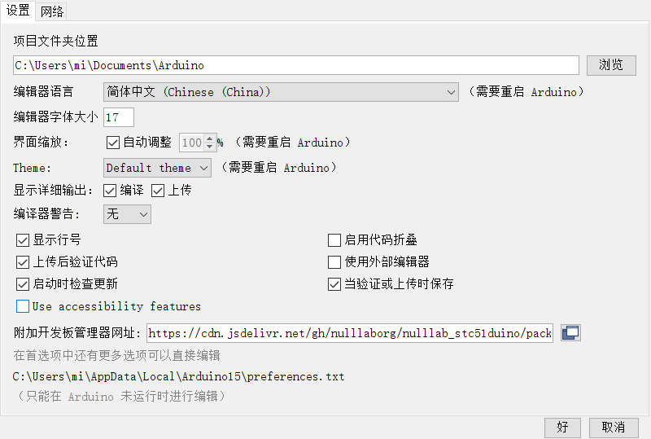
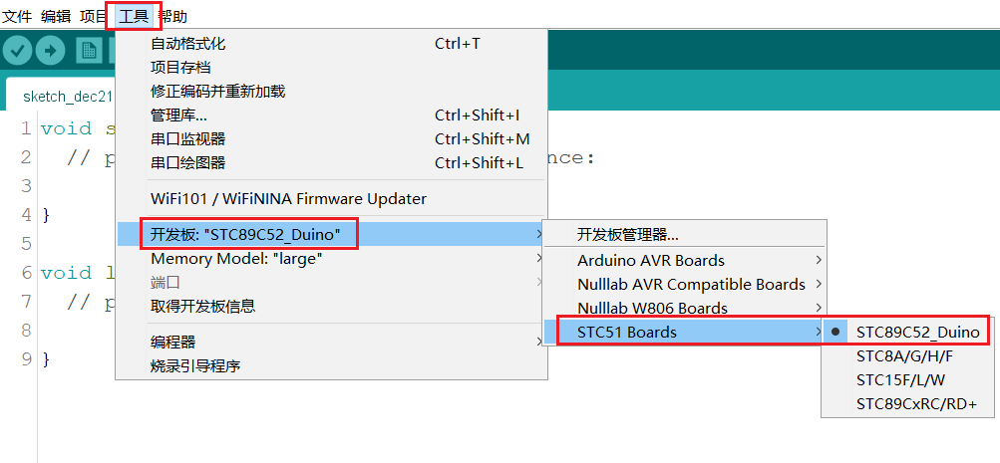

# STC51duino
基于[STC](https://www.stcmcudata.com/)公司的8051内核的系类单片机的arduino软件开发支持包，目前先做STC89C52RC这款学习型单片机的支持包，方便开发者学习使用
后续将陆续适配STC12/STC15/STC8等主流系类芯片。

## STC51duino开发板Arduino IDE支持包安装

1、**文件->首选项**

2、在附加开发板管理器网址输入如下网址：

> https://cdn.jsdelivr.net/gh/nulllaborg/nulllab_stc51duino/package_nulllab_stc51duino_proxy_index.json

3、**工具->开发板->开发板管理**
搜索STC51duino,选择最新版本安装（如果搜索不到，请安装arduino IDE1.8.15以上）

4、**工具->开发板**

代表STC51duino开发环境搭建完成

## nulllab STC51duino开发计划
打勾的代表已经实现并验证，没有打勾的代表正在开发中，期待更多开发者一起维护

- [x] [开发STC8951C52_Duino学习型开发板]()
- [ ] [开发STC公司8051系类单片机的ISP命令行工具开发]()
- [ ] [完成STC8951C52RC+芯片的arduino api对接]()
- [ ] [开发STC15F2K60S2_Duino学习型开发板]()
- [ ] [开发STC12C5A60S2_Duino学习型开发板]()
- [ ] [开发STC8H8K64S4U_Duino学习型开发板]()